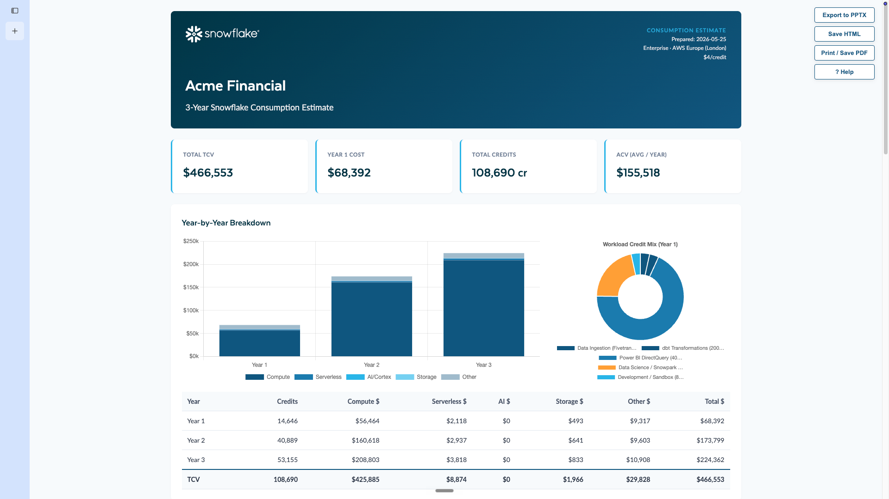
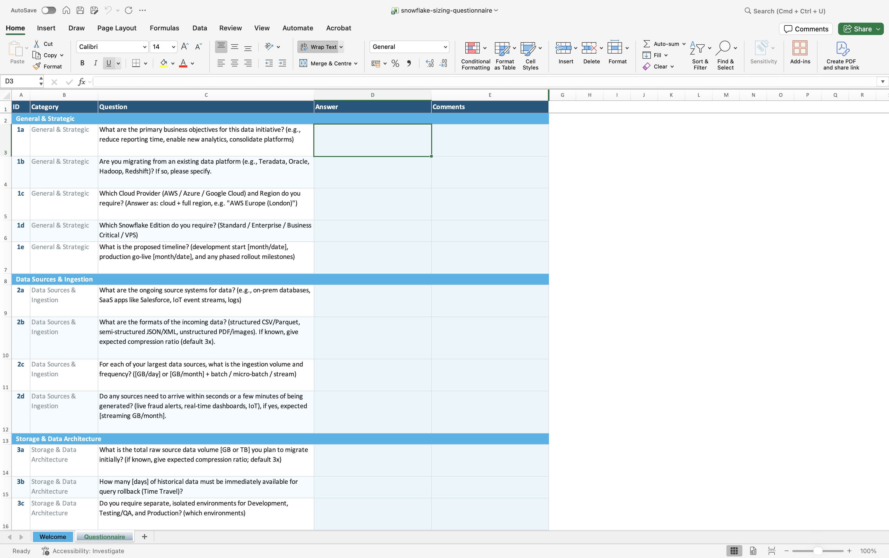

# snowflake-sizing

Generate accurate, defensible Snowflake consumption estimates and interactive customer-facing HTML and PPTX proposals.

[Watch A Demo](https://drive.google.com/file/d/1033ygzN8EMsBgfkw3aFmfGW3UeiF15-0/view?usp=drive_link)



## Prerequisites

The skill performs mandatory live research against Glean and Gong. It will hard-fail at preflight if either is unavailable.

- **Glean MCP:** `cortex mcp add glean https://snowflake-be.glean.com/mcp/default --transport http`
- **SNOWHOUSE connection with `GONG_SHARE.GONG_DATA_CLOUD` access:** `cortex connections set snowhouse` (verify with `cortex connections list`)

## Usage

```bash
/snowflake-sizing <context-file> [options]
```

**Options:**

| Option                | Default                               | Description                                     |
| --------------------- | ------------------------------------- | ----------------------------------------------- |
| `--customer "Name"` | (from context file)                   | Customer name for proposal                      |
| `--years N`         | `3`                                 | Contract length in years                        |
| `--edition X`       | `Enterprise`                        | Standard / Enterprise / Business Critical / VPS |
| `--region "X"`      | `"AWS US East (Northern Virginia)"` | Full region string                              |

## Example

```bash
/snowflake-sizing temp/acme-discovery-notes.txt --customer "ACME Corp" --years 3 --edition Enterprise --region "AWS Europe (London)"
```

## Sizing Questionnaire

A pre-built questionnaire helps you gather the inputs needed for an accurate sizing.
Two formats are available in Excel and Word

| Format          | Local file                                            | Hosted version                                                                                                                                     |
| --------------- | ----------------------------------------------------- | -------------------------------------------------------------------------------------------------------------------------------------------------- |
| **Excel** | [`questionnaire/snowflake-sizing-questionnaire.xlsx`](questionnaire/snowflake-sizing-questionnaire.xlsx) | [Google Sheets](https://docs.google.com/spreadsheets/d/1rkDlTq3SCz7Sd96IRNM88Dv4N3Ev4xgr/edit?gid=1057630272#gid=1057630272)                          |
| **Word**  | [`questionnaire/snowflake-sizing-questionnaire.docx`](questionnaire/snowflake-sizing-questionnaire.docx) | [Google Docs](https://docs.google.com/document/d/1WWWymiDfp6kUJuHki3-qkiNcsPpWq4Ad/edit?usp=drive_link&ouid=100681408935362139529&rtpof=true&sd=true) |



Fill out the questionnaire with the customer, export or copy the completed answers to a text file, and pass that file as the `<context-file>` argument to `/snowflake-sizing`.

## Output

Three artifacts:

- `sizings/<customer-slug>-<N>year-sizing-v1-<YYYY-MM-DD>.html` — single self-contained interactive proposal.
- `sizings/<customer-slug>-<N>year-sizing-v1-<YYYY-MM-DD>.json` — portable sizing spec (the `SIZING_SPEC` object). Source of truth for the HTML, the in-browser PPTX export, and future export formats (DOCX, XLSX).
- `temp/<customer-slug>-research-evidence.md` — Glean + Gong audit trail (B1/B2/B3 hits, Gong call inventory with retry log, verbatim transcript turns, and sizing-impacting findings).

The `sizings/` directory holds customer outputs; the generated `.html` and `.json` files are git-ignored (only the directory itself ships, via `.gitkeep`). `temp/` is also git-ignored (scratch files only).

### Sizing Spec (`.json`)

The `.json` file contains the complete `SIZING_SPEC` object — all workloads, serverless features, AI config, storage, metadata, assumptions, and confirm_required items. It is the source of truth from which the HTML is derived, from which the in-browser PPTX deck is built, and from which future export formats (DOCX, XLSX) will be generated.

**Browser round-trip:** Open any saved HTML and click **Export JSON** to extract the current `SIZING_SPEC` (including any browser edits) back to a `.json` file.

Open the HTML in any browser. The proposal is fully interactive — all configuration changes propagate immediately to all output sections (KPI tiles, Year-by-Year Breakdown, charts, Scenario Comparison).

### Interactive tabs

| Tab                       | What you can edit                                                                                                                                                                                                                                              |
| ------------------------- | -------------------------------------------------------------------------------------------------------------------------------------------------------------------------------------------------------------------------------------------------------------- |
| **Global Settings** | Cloud / Region / Edition, contract years, annual growth %, default ramp curve, dev-start / go-live months, Platform Credit discount override                                                                                                                   |
| **Warehouses**      | Size (XS–6XL), warehouse type (Standard Gen1 / Gen2 / Snowpark-Optimized with memory config), hours/day, days/month, cluster min/max, auto-suspend; add / delete workload cards; edit / delete the per-warehouse sourcing note (the `SOURCED:` line) inline |
| **Serverless**      | Toggle and size each serverless feature (Snowpipe, Search Optimization, Materialized Views, Dynamic Tables, etc.)                                                                                                                                              |
| **AI / Cortex**     | Cortex Complete, Cortex Agents, Snowflake Intelligence, Cortex Code (CLI / Snowsight / Desktop surfaces), Cortex Analyst, Cortex Search, Document AI, AI Functions                                                                                             |
| **SPCS**            | Instance type, generation (gen2 families sourced live: HIGHMEM_X64 / CPU_X64 / GPU), node count, hours/month; add / delete instances                                                                                                                           |
| **OpenFlow**        | Deployment (SPCS / BYOC), source connections, vCPU, hours/month; add / delete connectors                                                                                                                                                                       |
| **Storage**         | Raw TB, compression ratio, annual growth %, Time Travel days, churn rate %; per-year breakdown table refreshes live                                                                                                                                            |
| **Collaboration**   | Reader and Managed accounts with warehouse size, hours/day, days/month; add / delete accounts                                                                                                                                                                  |
| **Replication**     | Source / target regions, initial TB, monthly change TB, credits/TB, replica storage rate, growth/YoY; enable / disable per relationship                                                                                                                        |

### Output sections (all update live)

- **KPI tiles** — TCV, Year 1 cost, total credits, effective credit rate
- **Year-by-Year Breakdown** — per-workload credit and dollar totals for each contract year
- **Stacked bar chart** — annual spend by workload group
- **Donut chart** — credit share by workload group
- **Scenario Comparison** — **Expected** is the locked base case: it reuses the exact Year-by-Year computation (full cost stack, per-workload ramp), so its TCV always matches the headline KPI and the Year-by-Year Breakdown. **Conservative** (slower ramp / lower growth) and **Aggressive** (faster ramp / higher growth) are editable sensitivity bands computed over the same full stack. Editing the Expected card's growth % updates the base-case `annual_growth_rate` directly.

### Additional features

- **Birdbox ramp curves** — per-workload power-law ramp from `dev_start_month` to `go_live_month` (Slowest / Slow / Linear / Fast / Fastest / Manual). Global Settings defaults seed all new rows; individual rows can override.
- **Platform Credit discount override** — toggle in Global Settings accepts a net rate ($/credit) or discount %. AI Credits remain fixed at $2.00 global / $2.20 regional (discount does not apply per Snowflake policy).
- **Save Version** — top-right button snapshots the current `SIZING_SPEC` (including all SE edits), bumps `meta.version_number`, and downloads a self-contained HTML file named `<slug>-<N>year-sizing-v<N>-<YYYY-MM-DD>.html`.
- **Export to PPTX** — builds a Snowflake-branded deck entirely in the browser from the current `SIZING_SPEC` (including any live edits) and downloads it as a `.pptx`. No local server, bridge, or Python step is required. See [PPTX Export](#pptx-export) below.
- **Per-feature tooltips** — `ⓘ` icon next to every togglable feature explains what it is and how it bills. Hidden in print mode.
- **Editable assumptions** — Stated Assumptions and Requires Confirmation items are `contenteditable` in the browser. Add, delete, or reword inline; changes persist in `SIZING_SPEC` and are saved by Save Version.
- **Editable sourcing notes** — the `SOURCED:` / `ASSUMPTION:` line under each warehouse card is `contenteditable` too. Edit the source label and note text inline, delete the note with the `✕` button, or re-add it with **+ Add sourcing note**. Changes persist in `SIZING_SPEC` and are saved by Save Version; the empty-note affordance is hidden in print / PDF output.
- **Scenario toggle** — checkbox above the Scenario Comparison grid to show/hide the Conservative and Aggressive cards.
- **Print / Save as PDF** — floating button (primary) opens the native browser print dialog; choose "Save as PDF" as the destination for a clean multi-page A4 PDF. The `@media print` rules expand all tabs in flow, reflow Chart.js canvases, hide interactive chrome, and keep KPI tiles, charts, and table rows from splitting across page boundaries.

## PPTX Export

Open any generated proposal HTML and click **Export to PPTX**. The deck is
assembled **entirely in the browser** from the current in-page `SIZING_SPEC`
(JSZip + DOMParser against the embedded base template), so it picks up any live
SE edits with no server, bridge, or Python step. The button works from a
file:// URL or anywhere the HTML is opened.

The base deck is baked into the HTML at build time as `SIZING_BASE_TEMPLATE_B64`
from `assets/templates/sizing-base-template.pptx`. To refresh that embedded
template after editing the base deck, re-embed it with:

```bash
python3 scripts/embed-pptx-assets.py
```

### Deck contents (up to 10 slides)

| #    | Slide                                                                     |
| ---- | ------------------------------------------------------------------------- |
| 1    | Title                                                                     |
| 2    | Safe Harbor*(toggle:`meta.include_safe_harbor`)*                        |
| 3    | Agenda*(toggle:`meta.include_agenda`)*                                  |
| 4    | Understanding Your Snowflake Costs                                        |
| 5    | Cost Detail by Year                                                       |
| 6    | Cost Mix by Workload / Category*(toggle:`meta.include_workload_donut`)* |
| 7    | Year-by-Year chart                                                        |
| 8    | Warehouse Workloads                                                       |
| 9    | Serverless, AI & Other Compute                                            |
| 10   | Scenario Comparison*(toggle:`meta.include_scenarios`)*                  |
| last | Thank You                                                                 |

## Context File Format

Any combination of:

- Call transcripts (plain text or copied from Gong)
- Completed sizing questionnaire (Word, PDF, or plain text)
- Discovery notes
- Company background

The more detail the better. Missing information will be flagged as assumptions or confirmed requirements.

## Pricing Data

Rates are sourced **live** from the public Snowflake pricing calculator at render
time, with a deterministic offline fallback chain so a fresh clone always works:

1. **Live fetch** — `framework/live_pricing.py` scrapes the calculator page for its
   version-specific JSON endpoints (`pricing` + `regions`), fetches them, and
   attaches them natively under a `calc` namespace in the pricing dict. A
   successful fetch refreshes the runtime cache.
2. **Cache** — `assets/live_pricing_cache.json` (git-ignored), the last successful fetch.
3. **Committed seed** — `assets/live_pricing_seed.json`, a checked-in native snapshot
   so offline / fresh-clone renders are correct and deterministic.
4. **Static master** — `assets/snowflake_pricing_master.json` supplies the sections
   the calculator does not cover (serverless, OpenFlow, Postgres, replication, ramp
   curves, reference values) and remains the final fallback.

The live block fixes the historical 5XL/6XL = 1-credit bug and adds Gen2 (per-cloud),
Snowpark-Optimized (memory configurations), and the SPCS compute pools (HIGHMEM_X64 /
CPU_X64 / GPU). Cortex Complete / Analyst LLM token rates stay in the static master
(the calculator does not publish them).

**Reading rates** is centralised in `framework/calc_access.py` (Python) and the
`PricingData` adapter in the template (JS) — a single native-shape accessor layer
shared by the cost math and the in-page recalculation.

### Freshness automation & per-sizing pinning

A scheduled GitHub Actions workflow (`.github/workflows/pricing-refresh.yml`,
weekly + manual) keeps the committed data fresh:

- **Seed auto-refresh** (`scripts/refresh-seed.py`) fetches the live calculator and
  rewrites `assets/live_pricing_seed.json` **only if** the fetch passes the same
  structural + range guards as `verify-pricing-json` (factored into the importable
  `framework/pricing_checks.py`) **and** the content actually changed. A failed
  guard or fetch leaves the last-good seed untouched.
- **PDF staleness detection** (`scripts/check-pdf-freshness.py`, detect-only) reads
  the `Effective:` date off the legal *Service Consumption Table* PDF and compares
  it to the master's `metadata.effective_date`. When the PDF is newer the workflow
  opens/updates a GitHub issue — it **never** edits the master (the static sections
  are still hand-curated from the PDF). Alerting is CI-only; there are no
  render-time staleness warnings.

**Per-sizing pin:** `spec-prepare.py` stamps a `pricing_snapshot` provenance block
(master/calc dates, container id, source URLs, a SHA-256 of the merged pricing) into
each spec and writes the exact pricing it used to a `sizings/<slug>.pricing.json`
sidecar. `render-html.py` auto-loads that sidecar so a re-render reproduces identical
numbers; `--latest` renders against fresh pricing one-off, and `--repin` refreshes the
pin. (`sizings/*` is git-ignored, so the sidecar is a local artifact to archive with
the proposal.)

```bash
# Default render auto-loads the pinned <slug>.pricing.json sidecar (reproducible):
python3 scripts/render-html.py --spec sizings/<slug>.json --out sizings/<slug>.html

# Force offline, pin an explicit pricing JSON, render fresh, or re-pin:
python3 scripts/render-html.py --spec ... --out ... --offline
python3 scripts/render-html.py --spec ... --out ... --pricing assets/snowflake_pricing_master.json
python3 scripts/render-html.py --spec ... --out ... --latest    # one-off fresh fetch
python3 scripts/render-html.py --spec ... --out ... --repin      # fresh fetch + re-pin

# Derive credit / AI-credit / storage rates for a region (Phase 1 helper):
python3 scripts/derive-rates.py --cloud AWS --region "London" --edition Enterprise

# Refresh the runtime cache or re-commit the offline seed:
python3 framework/live_pricing.py --refresh
python3 framework/live_pricing.py --write-seed     # update assets/live_pricing_seed.json
python3 scripts/refresh-seed.py [--dry-run]        # guarded refresh (used by CI)

# Structural + range sanity checks (live, --offline, or a specific file):
python3 scripts/verify-pricing-json.py [--offline] [--pricing <file>]

# Detect whether the legal PDF is newer than the master (detect-only):
python3 scripts/check-pdf-freshness.py
```

To update the static sections, edit `assets/snowflake_pricing_master.json` and its
`metadata.effective_date` (the PDF detector flags when this is overdue); to refresh
the live snapshot, run `scripts/refresh-seed.py` or `live_pricing.py --write-seed`.
